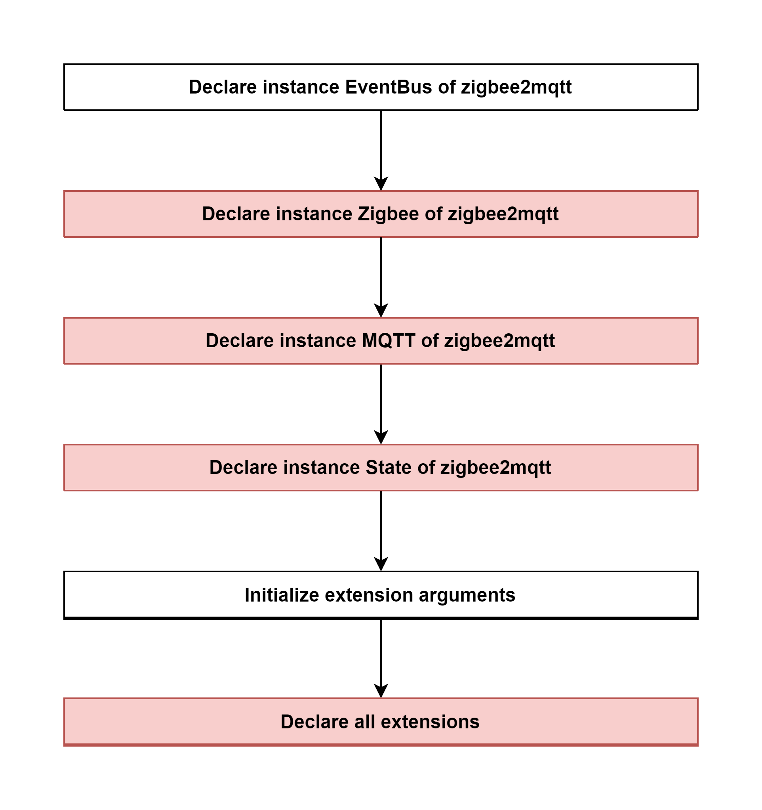

# Declare instance Controller of zigbee2mqtt

### Description
- This is the flow of `constructor` method of Controller of zigbee2mqtt.
  
#### Class [Controller (zigbee2mqtt)](../objects/controller_zigbee2mqtt.md)

#### External flow: [Zigbee Document - Step 4](../zigbee_document.md#step-4-declare-instance-controller-of-zigbee2mqtt)

### Path
> zigbee2mqtt\lib\controller.ts

### Flow

### Step 1: Declare instance EventBus of zigbee2mqtt

#### Class [EventBus]()

#### Description
- This object has a property as `events.EventEmitter` that will 
  - Creates a `Promise` that is fulfilled when the `EventEmitter` emits the given event or that is rejected if the `EventEmitter` emits `'error'` while waiting. 
  - The `Promise` will resolve with an array of all the arguments emitted to the given event.

#### Flow
- Set max listeners is 100.
- Add an event listener that listen event `error`. Callback function: `onError`

### Step 2: [Declare instance Zigbee of zigbee2mqtt](4_2_declare_instance_zigbee_of_zigbee2mqtt.md)

### Step 3: Declare instance MQTT of zigbee2mqtt

### Step 4: Declare instance State of zigbee2mqtt

### Step 5: Initialize extension arguments
Arguments includes:
- this.zigbee
- this.mqtt
- this.state
- this.publishEntityState
- this.eventBus
- this.enableDisableExtension
- this.restartCallback
- this.addExtension

### Step 6: Declare all extensions