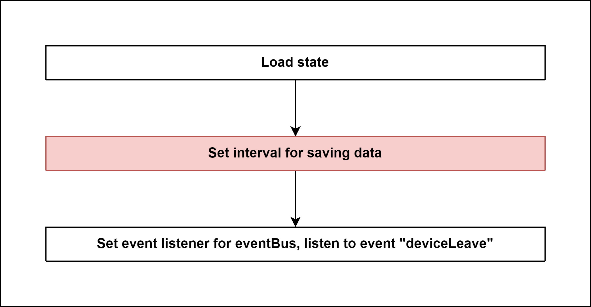

# Start State instance of zigbee2mqtt 

## External flow: [Start Controller of zigbee2mqtt - Step 1](5_start_controller_of_zigbee2mqtt.md)

### Description
- This is the flow of `start()` method of Controller of zigbee2mqtt.  
#### Class [State](...)

### Path
> zigbee2mqtt\lib\state.ts
> 
### Flow

### Step 1: Load state
- Try to load state from file (default path: `zigbee2mqtt\data\state.json`, decoder: `utf8`)
- Error occurs when file is corrupted or file does not exist.

### Step 2: [Set interval for saving data]()

### Step 3: Set event listener for eventBus, listen to event "deviceLeave"

