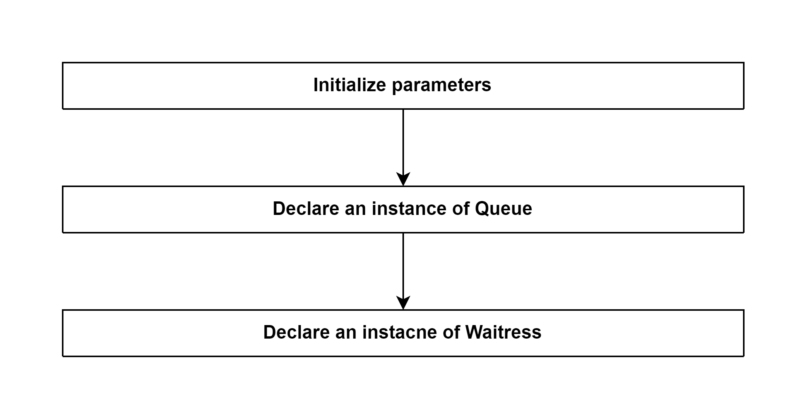

# Declare CLASS Znp of ZStackAdapter (ZNP = Zigbee Network Processor) 

## External flow: [Declare an instance of Adapter (type: ZStackAdapter) - Step 1](5_3_4_2_3_declare_an_instance_of_adapter_(type_zstackadapter).md)

### Description
- This is the flow of `constructor()` method of Znp of zigbee-herdsman.
  
#### Class [Znp](...)

### Path
> zigbee-herdsman\src\adapter\z-stack\znp\znp.ts

### Flow

### Step 1: Initialize parameters
- path
- baudRate (if not defined, baudRate = 115200)
- rtscts (Request to Send / Clear to Send)
- portType (`socket` | `serial`)
- initialized (`true` | `false`)

### Step 2: Declare an instance of Queue
- Initialize this.jobs as an array
- Initialize this.concurrent 

Class [Queue]()

### Step 3: Declare an instacne of Waitress

### Step 4: Add event listener for this.znp ("received", ...)

### Step 5: Add event listener for this.znp ("close", ...)

