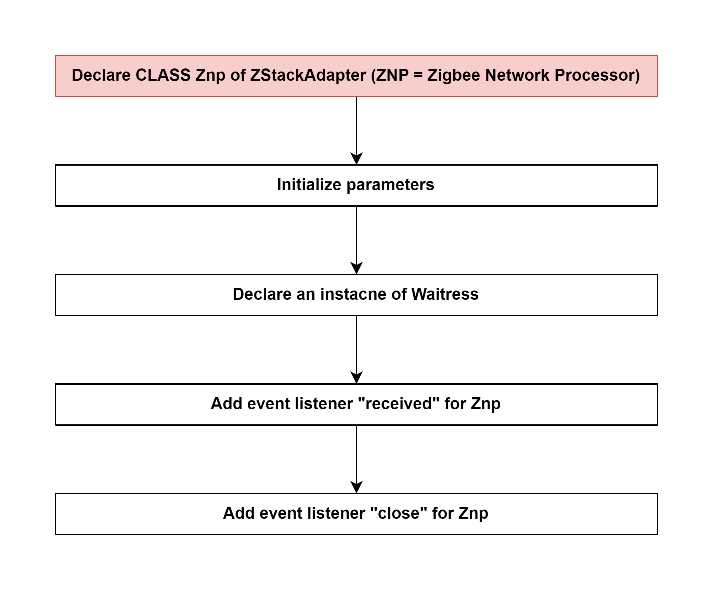

# Declare an instance of Adapter (type: ZStackAdapter) 

## External flow: [Create and inject Adapter - Step 3](5_3_4_2_create_and_inject_adapter.md#step-3-initialize-an-instance-of-adapter-type-zstackadapter)

### Description
- This is the flow of `constructor()` method of ZStackAdapter of `zigbee-herdsman`.
  
#### Class [ZStackAdapter](...)

### Path
> zigbee-herdsman\src\adapter\z-stack\adapter\zStackAdapter.ts

### Flow

### Step 1: [Declare CLASS Znp of ZStackAdapter (ZNP = Zigbee Network Processor)](5_3_4_2_3_1_declare_class_znp_of_zstackadapter_(znp_%3D_zigbee_network_processor).md)

### Step 2: Initialize parameters
- transactionID
- deviceAnnounceRouteDiscoveryDebouncers
- interpanLock
- interpanEndpointRegistered
- closing

### Step 3: Declare an instacne of Waitress
Initialize parameters:
- waiters
- timeoutFormatter
- validator
- currentID

Class [Waitress]()

### Step 4: Add event listener "received" for Znp
- Event: `received`
- Callback function: `this.onZnpRecieved.bind(this)`

Class [ZStackAdapter]()
Method [onZnpRecieved]()

### Step 5: Add event listener "close" for Znp

- Event: `close`
- Callback function: `this.onZnpClose.bind(this)`
  
Class [ZStackAdapter]()
Method [onZnpClose]()

## External flow: [Create and inject Adapter - Step 3](5_3_4_2_create_and_inject_adapter.md#step-3-initialize-an-instance-of-adapter-type-zstackadapter)