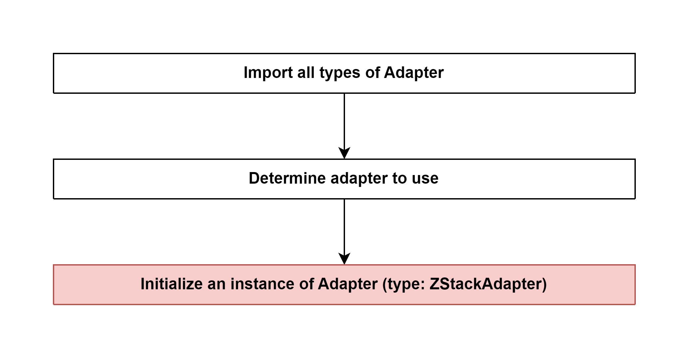

# Create and inject Adapter 

## External flow: [Start Controller of zigbee-herdsman - Step 2](5_3_4_start_controller_of_zigbee-herdsman.md#step-2-create-and-inject-adapter)

### Description
- This is the flow of **static** method `create()` of abstract class Adapter of `zigbee-herdsman`.
  
#### Abstract class [Adapter](...)

#### Class [zStackAdapter]()

### Path
> zigbee-herdsman\src\adapter\adapter.ts

### Flow

### Step 1: Import all types of Adapter
There are 4 types of adapters:
- ZStackAdapter
- DeconzAdapter
- ZiGateAdapter
- EZSPAdapter

### Step 2: Determine adapter to use
- If types of adapter is defined in `serialPortOptions`, choose that one. Otherwise, type of adapter is determined by validating the path of the `serialPortOptions` in a for loop (one of four types of adapter). 

### Step 3: [Declare an instance of Adapter (type: ZStackAdapter)](5_3_4_2_3_declare_an_instance_of_adapter_(type_zstackadapter).md)

Class [ZStackAdapter](...)

