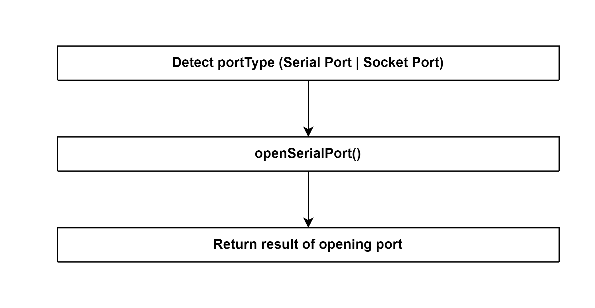

# Open Znp 

## External flow: [Start Adapter (ZStackAdapter) - Step 1](5_3_4_3_start_adapter_(zstackadapter).md#step-1-open-znp)

### Description
- This is the flow of `open()` method of Znp of zigbee-herdsman.

#### Class [Znp](...)

### Path
> zigbee-herdsman\src\adapter\z-stack\znp\znp.ts

### Flow

### Step 1: Detect port type
- Determine port type: `Serial Port` | `Socket Port`
- **For this system**, port type is `Serial Port`.

### Step 2: openSerialPort()
- Initialize an instance of `SerialPort` (defined in `node_modules`).
- Initialize an instance of `UnpiWriter` (more detail in class [Writer]())
- Attach a Writable stream to the readable stream so that it consequently switches into flowing mode and then pushes all the data that it has to the attached Writable ([readable.pipe()](https://www.geeksforgeeks.org/node-js-stream-readable-pipe-method/) method)
- Add event listener for `unpiParser`:
  - Event: `parsed`
  - Callback function: `onUnpiParsed()`

Class [Znp]()
Method [openSerialPort()]()
Method [onUnpiParsed()]()

### Step 3: Return result of opening port
- If the port is error:
  - The port will be closed.

- If the port is opened successfully:
  - Skip boot loader (Method [skipBootloader()]() of [Znp]())
  - Add one-time event listener:
    - Event: `close`
    - Callback function: `onPortClose()`
  - Add one-time event listener:
    - Event: `error`
    - Callback function: write debug log.

Method [onPortClose()]()

## External flow: [Start Adapter (ZStackAdapter) - Step 1](5_3_4_3_start_adapter_(zstackadapter).md#step-1-open-znp)