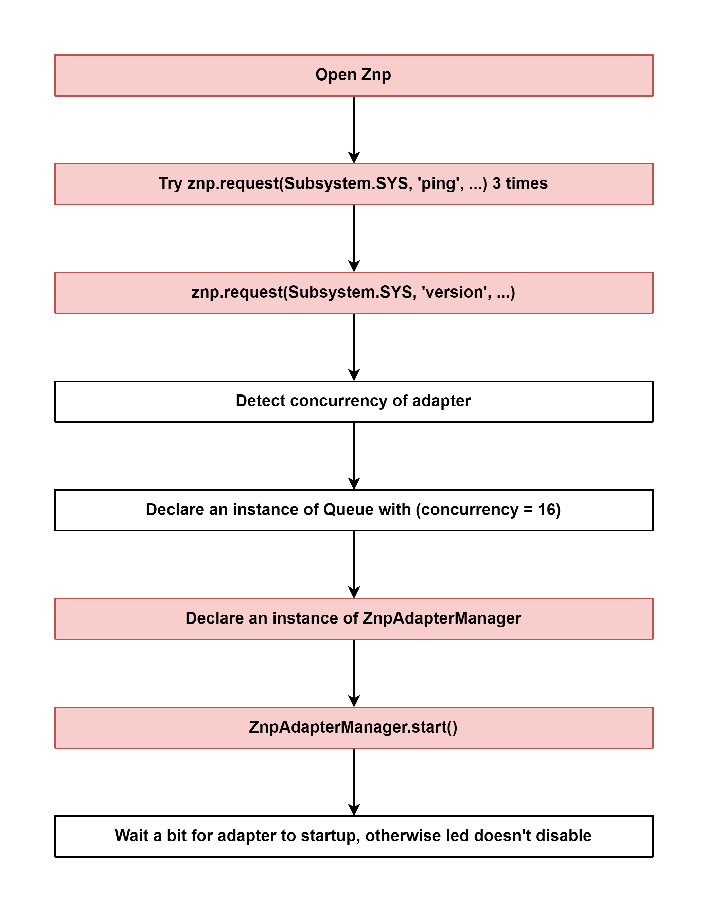

# Start Adapter (ZStackAdapter) 

## External flow: [Start Controller of zigbee-herdsman - Step 3](5_3_4_start_controller_of_zigbee-herdsman.md#step-3-start-adapter-zstackadapter)

### Description
- This is the flow of `start()` method of ZStackAdapter of zigbee-herdsman.
  
#### Class [ZStackAdapter](...)

### Path
> zigbee-herdsman\src\adapter\z-stack\adapter\zStackAdapter.ts

### Flow

### Step 1: [Open Znp](5_3_4_3_1_open_znp.md)

### Step 2: [Try this.znp.request(Subsystem.SYS, 'ping', ...) 3 times](5_3_4_3_2_try_this.znp.request(subsystem.sys%2C_'ping'%2C_...)_3_times.md)

### Step 3: [this.znp.request(Subsystem.SYS, 'version', ...)](5_3_4_3_3_this.znp.request(subsystem.sys%2C_'version'%2C_...).md)

### Step 4: Detect concurrency of adapter
- `Adapter concurrency` is **the amount of commands that the adapter can handle at the same time**.
- Example: If it is set to 2 and you send a turn on command to 3 bulbs; the first 2 will be send immediately, the last one will be send whenever the first or second command has completed.
- For `CC2652P` adapter, it has `concurrency = 16`

### Step 5: Declare an instance of Queue with (concurrency = 16)
- Queue is a list of **processing** commands.
- Length of the Queue is the concurrency of adapter.
  
Class [Queue]()

### Step 6: Declare an instance of ZnpAdapterManager
- ZNP Adapter Manager is responsible for handling adapter startup, network commissioning, configuration backup and restore.

Class [ZnpAdapterManager]()

### Step 7: ZnpAdapterManager.start()
- Performs ZNP (Zigbee Network Processor) adapter startup. After this method returns the adapter is configured, endpoints are registered and network is ready to process frames.

Class [ZnpAdapterManager]()
Method [start()]()

### Step 8: Wait a bit for adapter to startup, otherwise led doesn't disable
- Only zStack3x0 with 20210430 and greater support LED.