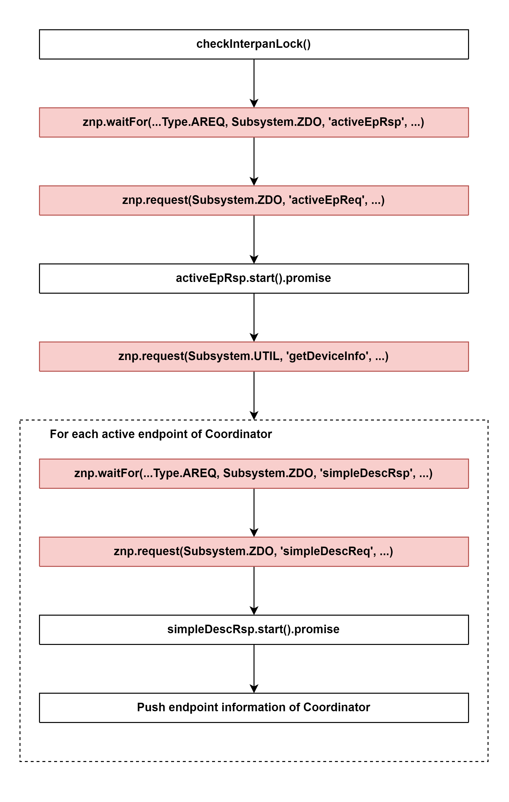

# Add coordinator to the database if it is not there yet 

## External flow: [Start Controller of zigbee-herdsman - Step 8](5_3_4_start_controller_of_zigbee-herdsman.md#step-8-add-coordinator-to-the-database-if-it-is-not-there-yet)

### Description
- This is the `getCoordinator()` method of ZStackAdapter of zigbee-herdsman.
- It is a job (`<FUNCTION>`) added in `queue.execute()`.

#### Syntax: `queue.execute<T>(async <FUNCTION>)`

#### Class [ZStackAdapter](...)

### Path
> zigbee-herdsman\src\adapter\z-stack\adapter\zStackAdapter.ts

## Job (`<FUNCTION>`)

### Flow

### Step 1: checkInterpanLock()
- If `interpanLock` value is `True`, an Error will be thrown: `Cannot execute command, in Inter-PAN mode`
- [Inter-PAN mode](https://www.google.com.vn/)

### Step 2: [znp.waitFor(...Type.AREQ, Subsystem.ZDO, 'activeEpRsp', ...)](5_3_4_8_2_znp.waitfor(...type.areq%2C_subsystem.zdo%2C_'activeeprsp'%2C_...).md)

### Step 3: [znp.request(Subsystem.ZDO, 'activeEpReq', ...)](5_3_4_8_3_znp.request(subsystem.zdo%2C_'activeepreq'%2C_...).md)

### Step 4: activeEpRsp.start().promise
- Get ID of the `activeEpRsp` waiter
- Set timeout for the `activeEpRsp` waiter: [timeouts.default](znp) = 10 seconds 
- Start timer

Class [Waitress]()
Method [waitFor]()

### Step 5: [znp.request(Subsystem.UTIL, 'getDeviceInfo', ...)](5_3_4_8_5_znp.request(Subsystem.UTIL%2C%20'getDeviceInfo'%2C%20...).md)

### Step 6: For each active endpoint of Coordinator

#### 6.1 [znp.waitFor(...Type.AREQ, Subsystem.ZDO, 'simpleDescRsp', ...)](5_3_4_8_6_1_znp.waitfor(...type.areq%2C_subsystem.zdo%2C_'simpledescrsp'%2C_...).md)

#### 6.2 znp.request(Subsystem.ZDO, 'simpleDescReq', ...)

#### 6.3 simpleDescRsp.start().promise
- Get ID of the `simpleDescRsp` waiter
- Set timeout for the `simpleDescRsp` waiter: [timeouts.default](znp) = 10 seconds 
- Start timer

Class [Waitress]()
Method [waitFor]()
#### 6.4 Push endpoint information of Coordinator

### Method [queue.execute()](...)