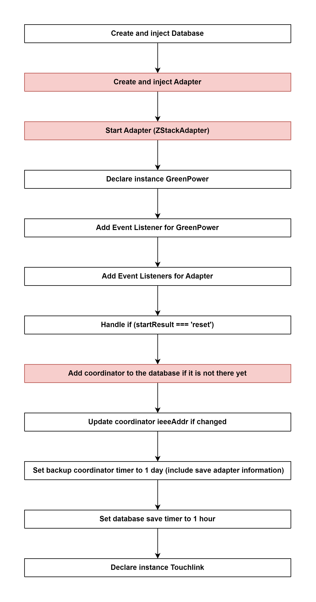

# Start Controller of zigbee-herdsman 

## External flow: [Start Zigbee instance of zigbee2mqtt - Step 4](...)

### Description
- This is the flow of `start()` method of Controller of `zigbee-herdsman`.
  
#### Class [Controller (zigbee-herdsman)](...)

### Path
> zigbee-herdsman\src\controller\controller.ts

### Flow

### Step 1: Create and inject Database
- Current path of database: `zigbee2mqtt\data\database.db`

Class [Database]()

### Step 2: [Create and inject Adapter](5_3_4_2_create_and_inject_adapter.md)

### Step 3: [Start Adapter (ZStackAdapter)](5_3_4_3_start_adapter_(zstackadapter).md)

### Step 4: Declare instance GreenPower

Class [GreenPower](...)

### Step 5: Add Event Listener for GreenPower
- Event: `deviceJoined`
- Callback function: `onDeviceJoinedGreenPower.bind(this)`

Class [GreenPower]()
Method [onDeviceJoinedGreenPower()]()

### Step 6: Add Event Listeners for Adapter
#### 6.1 deviceJoined
- Event: `deviceJoined`
- Callback function: [onDeviceJoined.bind(this)]()
#### 6.2 zclData
- Event: `zclData`
- Callback function: [onZclOrRawData('zcl', data)]()
#### 6.3 rawData
- Event: `rawData`
- Callback function: [onZclOrRawData('raw', data)]()
#### 6.4 disconnected
- Event: `disconnected`
- Callback function: [onAdapterDisconnected.bind(this)]()
#### 6.5 deviceAnnounce
- Event: `deviceAnnounce`
- Callback function: [onDeviceAnnounce.bind(this)]()
#### 6.6 deviceLeave
- Event: `deviceLeave`
- Callback function: [onDeviceLeave.bind(this)]()
#### 6.7 networkAddress
- Event: `networkAddress`
- Callback function: [onNetworkAddress.bind(this)]()

### Step 7: Handle `if` (startResult === 'reset')
- Backup database (copy database file to backup database file)
  - Database path: `zigbee2mqtt\data\database.db`
  - Backup database path: `zigbee2mqtt\data\database.db.backup`
- Remove all `groups` from database
- Remove all `devices` from database
- Backup coordinator (adapter): [controller.backup()]() (zigbee-herdsman) &rarr; `adapter.backup()` (abstract class) &rarr; [zStackAdapter.backup()]() &rarr; **[AdapterBackup.createBackup()]()**

### Step 8: [Add coordinator to the database if it is not there yet](5_3_4_8_add_coordinator_to_the_database_if_it_is_not_there_yet.md)

### Step 9: Update coordinator ieeeAddr if changed
- Can happen due to e.g. reflashing

### Step 10:  Set backup coordinator timer to 1 day (include save adapter information)
- Run [controller.backup()]() after an interval of time: `1 day`

### Step 11: Set database save timer to 1 hour
- Run [controller.databaseSave()]() after an interval of time: `1 hour`

### Step 12: Declare instance Touchlink

Class [Touchlink]()
