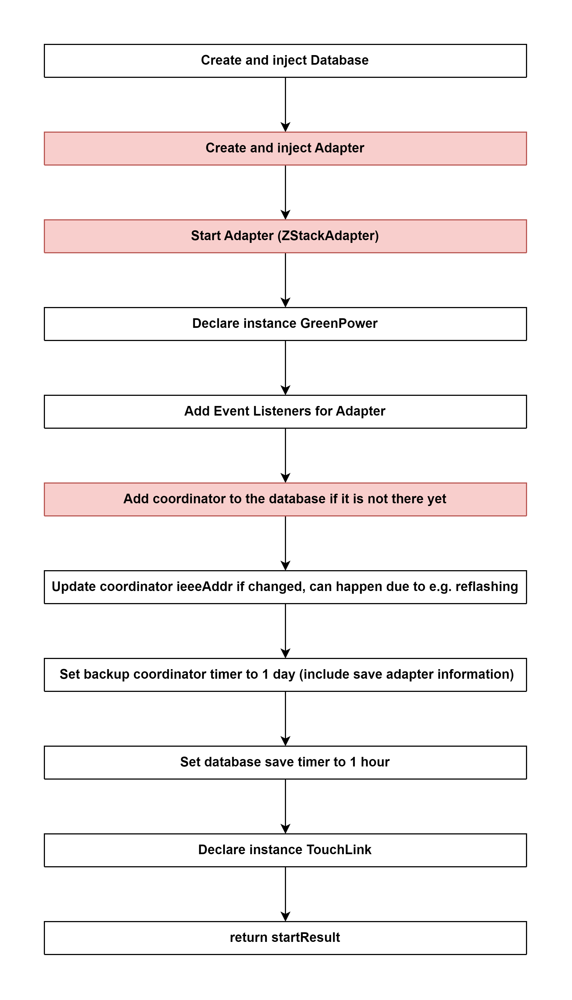

# Start Controller of zigbee-herdsman 

## External flow: [Start Zigbee instance of zigbee2mqtt - Step 4](...)

### Description
- This is the flow of `start()` method of Controller of `zigbee-herdsman`.
  
#### Class [Controller (zigbee-herdsman)](...)

### Path
> zigbee-herdsman\src\controller\controller.ts

### Flow

### Step 1: Create and inject Database
- Current path of database: `zigbee2mqtt\data\database.db`

Class [Database]()

### Step 2: [Create and inject Adapter](5_3_4_2_create_and_inject_adapter.md)

### Step 3: [Start Adapter (ZStackAdapter)](5_3_4_3_start_adapter_(zstackadapter).md)

### Step 4: Declare instance GreenPower

### Step 5: Add Event Listeners for Adapter

### Step 6: Add coordinator to the database if it is not there yet

### Step 7: Update coordinator ieeeAddr if changed, can happen due to e.g. reflashing

### Step 8:  Set backup coordinator timer to 1 day (include save adapter information)

### Step 9: Set database save timer to 1 hour

### Step 10: Declare instance TouchLink

### Step 11: return startResult
