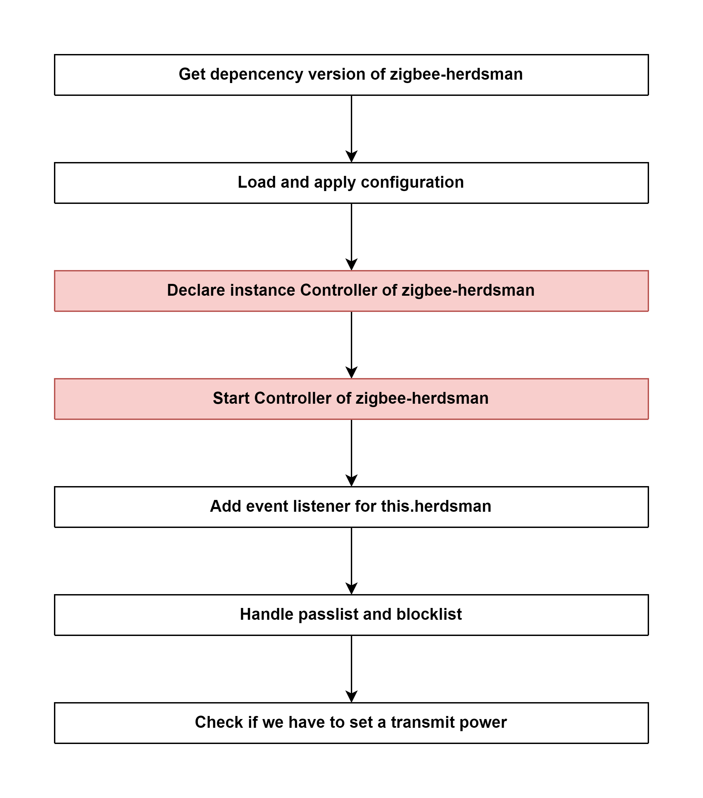

# Start Zigbee instance of zigbee2mqtt 

## External flow: [Start Controller of zigbee2mqtt - Step 3](5_start_controller_of_zigbee2mqtt.md#step-3-start-zigbee-instance-of-zigbee2mqtt)

### Description
- This is the flow of `start()` method of Zigbee of `zigbee2mqtt`.
  
#### Class [Zigbee](...)

### Path
> zigbee2mqtt\lib\zigbee.ts

### Flow

### Step 1: Get depencency version of zigbee-herdsman
- Current version: `0.14.27`

### Step 2: Load and apply configuration
All the following data are get from file `zigbee2mqtt\lib\util\settings.ts`
- network
  - panID
  - extendedPanID
  - channelList
  - networkKey
- databasePath
- databaseBackupPath
- backupPath
- serialPort
  - baudRate
  - rtscts
  - path
  - adapter
- adapter
  - concurrent
  - delay
  - disableLED

### Step 3: Declare instance Controller of zigbee-herdsman
- Valid channel (11 - 26)
- Valid network key (array, 16 digits long)
- Valid extended PAN ID (array, 8 digits long)
- Valid PAN ID (0x0001 - 0xFFFE)

Class [Controller (zigbee-herdsman)]()

### Step 4: [Start Controller of zigbee-herdsman](5_3_4_start_controller_of_zigbee-herdsman.md)

Class [Controller (zigbee-herdsman)]()

### Step 5: Add event listener for this.herdsman
#### 5.1 adapterDisconnected
- Event: `adapterDisconnected`
- Callback function: `eventBus.emitAdapterDisconnected()`

#### 5.2 lastSeenChanged
- Event: `lastSeenChanged`
- Callback function: `eventBus.emitLastSeenChanged(...)`

#### 5.3 permitJoinChanged
- Event: `permitJoinChanged`
- Callback function: `eventBus.emitPermitJoinChanged(data)`

#### 5.4 deviceNetworkAddressChanged
- Event: `deviceNetworkAddressChanged`
- Callback function: `eventBus.emitDeviceNetworkAddressChanged({device})`

#### 5.5 deviceAnnounce
- Event: `deviceAnnounce`
- Callback function: `eventBus.emitDeviceAnnounce({device})`

#### 5.7 deviceInterview
- Event: `deviceInterview`
- Callback function: `eventBus.emitDeviceInterview({device, status: data.status})`

#### 5.8 deviceJoined
- Event: `deviceJoined`
- Callback function: `eventBus.emitDeviceJoined({device})`

#### 5.9 deviceLeave
- Event: `deviceLeave`
- Callback function: `eventBus.emitDeviceLeave({ieeeAddr: data.ieeeAddr, name})`

#### 5.10 message
- Event: `message`
- Callback function:
  - `if` (device.zh.type === 'Coordinator') &rarr; return
  - `else`: `eventBus.emitDeviceMessage({...data, device})`

### Step 6: Handle passlist and blocklist
- Get `passlist`: [settings.get().passlist]()
- Get `blocklist`: [settings.get().blocklist]()

#### `FOR EACH DEVICE`
- if `passlist.length > 0`
  - if device is not included in `passlist`, it will be removed.
- else if a device is in `blocklist`, it will be removed.

### Step 7: Check if we have to set a transmit power

