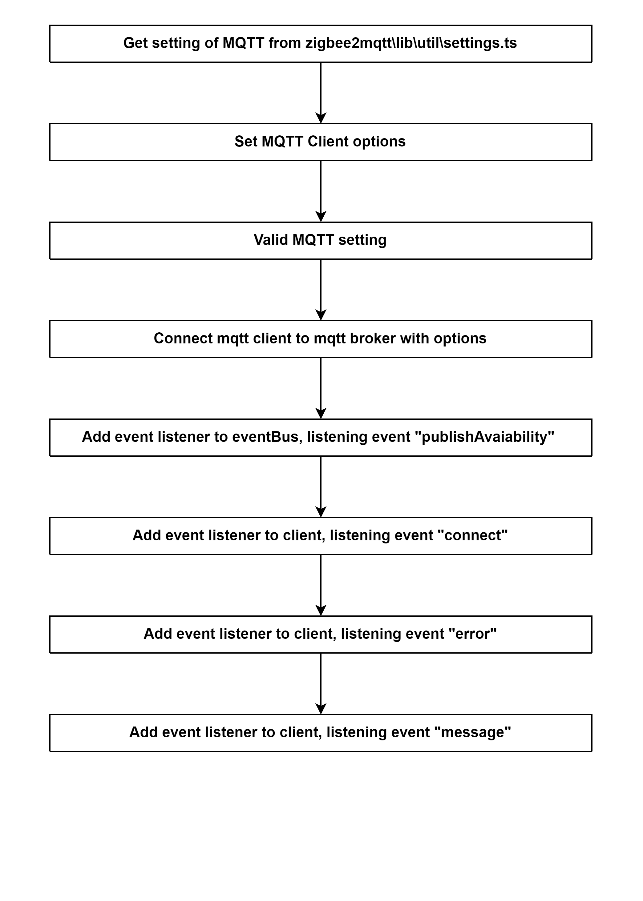

# Try connect MQTT 

## External flow: [Start Controller of zigbee2mqtt - Step 7](5_start_controller_of_zigbee2mqtt.md#step-7-try-connect-mqtt)

### Description
- This is the flow of `mqtt.connect()` method of Controller of zigbee2mqtt.
  
#### Class [MQTT](...)

### Path
> zigbee2mqtt\lib\mqtt.ts
> 
### Flow

### Step 1: Get setting of MQTT from zigbee2mqtt\lib\util\settings.ts
`M` = Mandatory 
`O` = Optional

- `M` base_topic: string,
- `M` include_device_information: boolean,
- `M` force_disable_retain: boolean
- `M` server: string,
- `O` version: number,
- `O` user: string,
- `O` password: string,
- `O` ca: string,
- `O` keepalive: number,
- `O` key: string,
- `O` cert: string,
- `O` client_id: string,
- `O` reject_unauthorized: boolean,

Setting path: `zigbee2mqtt\lib\types\types.d.ts`

### Step 2: Set MQTT Client options
- topic: `"z2m/LDT/bridge/state"`
- payload: `"{\"state\":\"offline\"}"`
- retain: `true`,
- qos: `1`,

### Step 3: Valid MQTT setting
- keepalive
- ca
- key & cert
- user & password
- client_id
- reject_unauthorized

### Step 4: Connect mqtt client to mqtt broker with options
- Run `MQTT.connect()`.
- This method is handled by `node_modules`.

### Step 5: Add event listener to eventBus, listening event "publishAvaiability"
- Event: `publishAvaiability`
- Callback function: [eventBus.publishStateOnline()]()
  - Publish to topic `'bridge/state'` state `online`.

### Step 6: Add event listener to client, listening event "connect"
- Event: `connect`
- Callback function: [onConnect()]()
  - Set interval for checking MQTT connection each `10 seconds`.
  - Run [eventBus.publishStateOnline()]()

### Step 7: Add event listener to client, listening event "error"
- Event: `error`
- Callback function: `reject(err)`

### Step 8: Add event listener to client, listening event "message"
- Event: `message`
- Callback function: [onMessage()]()
  - Since we subscribe to zigbee2mqtt/# we also receive the message we send ourselves, skip these.
  
