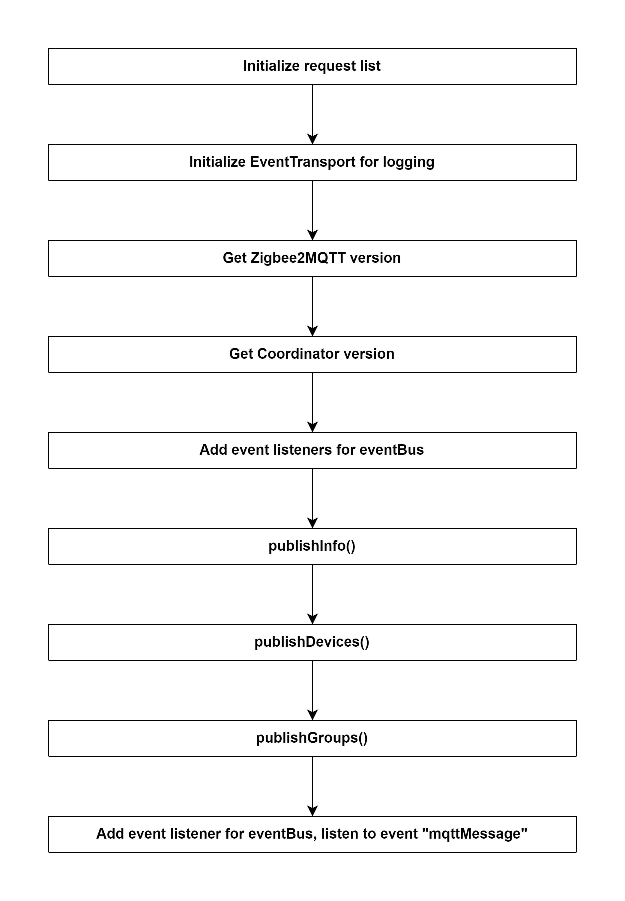

# Bridge.start() 

## External flow: [Start all extensions - Step 1](5_8_start_all_extensions.md#step-1-bridgestart)

### Description
- This is the flow of `start()` method of Bridge (extends Extension) of zigbee2mqtt.
  
#### Class [Bridge](...)

### Path
> zigbee2mqtt\lib\extension\bridge.ts

### Flow

### Step 1: Initialize request list

#### 1.1 deviceOptions
- Request: `device/options`
- Handling function: [Bridge.deviceOptions()]()

#### 1.2 deviceConfigureReporting
- Request: `device/configure_reporting`
- Handling function: [Bridge.deviceConfigureReporting()]()

#### 1.3 deviceRemove
- Request: `device/remove`
- Handling function: [Bridge.deviceRemove()]()

#### 1.4 deviceRename
- Request: `device/rename`
- Handling function: [Bridge.deviceRename()]()

#### 1.5 groupAdd
- Request: `group/add`
- Handling function: [Bridge.groupAdd()]()

#### 1.6 groupOptions
- Request: `group/options`
- Handling function: [Bridge.groupOptions()]()

#### 1.7 groupRemove
- Request: `group/remove`
- Handling function: [Bridge.groupRemove()]()

#### 1.8 groupRename
- Request: `group/rename`
- Handling function: [Bridge.groupRename()]()

#### 1.9 permitJoin
- Request: `permitJoin`
- Handling function: [Bridge.permitJoin()]()

#### 1.10 restart
- Request: `restart`
- Handling function: [Bridge.restart()]()

#### 1.11 touchlinkFactoryReset
- Request: `touchlinkFactoryReset`
- Handling function: [Bridge.touchlinkFactoryReset()]()

#### 1.12 touchlinkIdentify
- Request: `touchlink/identify`
- Handling function: [Bridge.touchlinkIdentify()]()

#### 1.13 touchlinkScan
- Request: `touchlink/scan`
- Handling function: [Bridge.touchlinkScan()]()

#### 1.14 healthCheck
- Request: `healthCheck`
- Handling function: [Bridge.healthCheck()]()

#### 1.15 bridgeOptions
- Request: `options`
- Handling function: [Bridge.bridgeOptions()]()

### Step 2: Initialize EventTransport for logging

### Step 3: Get Zigbee2MQTT version
- Current version: `1.25.0`

### Step 4: Get Coordinator version
- Current type: `zStack3x0`

### Step 5: Add event listeners for eventBus

#### 5.1 eventBus.onEntityRenamed
- Event: `deviceRenamed`
- Callback function: [Bridge.publishInfo()]()

#### 5.2 eventBus.onGroupMembersChanged
- Event: `groupMembersChanged`
- Callback function: [Bridge.publishGroups()]()

#### 5.3 eventBus.onDevicesChanged
- Event: `devicesChanged`
- Callback function: 
  - if [publishDevices()]()  then run [publishInfo()]().

#### 5.4 eventBus.onPermitJoinChanged
- Event: `permitJoinChanged`
- Callback function:
  - if NOT [zigbee.isStopping()]() then run [publishInfo()]().

#### 5.5 eventBus.onScenesChanged
- Event: `scenesChanged`
- Callback function: 
  - [publishDevices()]()
  - [publishGroups()]()

#### 5.6 eventBus.onDeviceJoined
- Event: `deviceJoined`
- Callback function: 
  - [publishDevices()]()
  - [publishEvent('device_joined', ...)]()

#### 5.7 eventBus.onDeviceLeave
- Event: `deviceLeave`
- Callback function: [publishEvent('device_leave', ...)]()

#### 5.8 eventBus.onDeviceNetworkAddressChanged
- Event: `deviceNetworkAddressChanged`
- Callback function: [publishDevices()]()

#### 5.9 eventBus.onDeviceInterview
- Event: `deviceInterview`
- Callback function: 
  - [publishDevices()]()
  - [publishEvent('device_interview', ...)]()

#### 5.10 eventBus.onDeviceAnnounce
- Event: `deviceAnnounce`
- Callback function: 
  - [publishDevices()]()
  - [publishEvent('device_announce', ...)]()

### Step 6: publishInfo()

Method [publishInfo()]()

### Step 7: publishDevices()

Method [publishDevices()]()

### Step 8: publishGroups()

Method [publishGroups()]()

### Step 9: Add event listener for eventBus, listen to event "mqttMessage"
- Event: `mqttMessage`
- Callback function: [onMQTTMessage()]()
