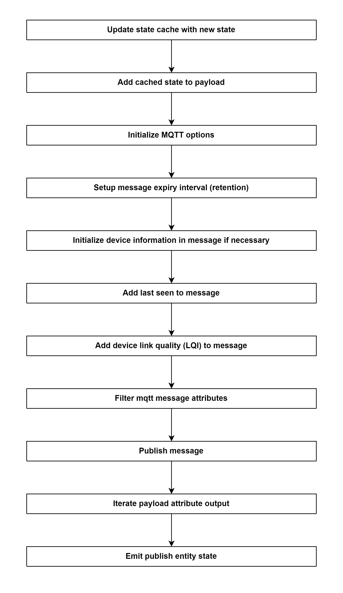

# Send all cached states 

## External flow: [Start Controller of zigbee2mqtt - Step 9](5_start_controller_of_zigbee2mqtt.md#step-9-send-all-cached-states)

### Description
- This is the flow of publishing state of all devices and groups. It is method `Controller.publishEntityState()`.
  
#### Class [Controller (zigbee2mqtt)](../objects/controller_zigbee2mqtt.md)

### Path
> zigbee2mqtt\lib\controller.ts

### Flow

For each device and group, run `Controller.publishEntityState`

### Step 1: Update state cache with new state

### Step 2: Add cached state to payload
- Initialize `message = newState`  

### Step 3: Initialize MQTT options
- `retain`: Retain MQTT messages of the device.
- `qos`: QoS level for MQTT messages of the device.

The Quality of Service (QoS) level is an agreement between the sender of a message and the receiver of a message that defines the guarantee of delivery for a specific message. There are 3 QoS levels in MQTT:
- At most once (0)
- At least once (1)
- Exactly once (2)

### Step 4: Setup message expiry interval (retention)
- `retention`: Sets the MQTT Message Expiry in seconds, Make sure to set mqtt.version to 5.

### Step 5: Initialize device information in message if necessary
- `friendlyName`
- `model`
- `ieeeAddr`
- `networkAddress`
- `manufacturerID`
- `manufacturerName`
- `powerSource`
- `applicationVersion`
- `stackVersion`
- `zclVersion`
- `hardwareVersion`
- `dateCode`
- `softwareBuildID`

### Step 6: Add last seen to message
- String with full date information

### Step 7: Add device link quality (LQI) to message

### Step 8: Filter mqtt message attributes

### Step 9: Publish message
- Publish string `message` via method [mqtt.publish()]()

### Step 10: Iterate payload attribute output
- Run [Controller.iteratePayloadAttributeOutput()]()

### Step 11: Emit event `eventBus.emitPublishEntityState()`
- Event: `publishEntityState`
