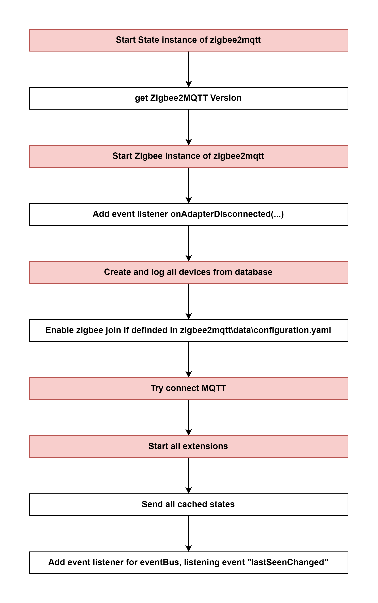

#  Start Controller of zigbee2mqtt

## External flow: [Zigbee Document - Step 5](../README.md#step-5-start-controller-of-zigbee2mqtt)

### Description
- This is the flow of `start()` method of Controller of zigbee2mqtt.
  
#### Class [Controller (zigbee2mqtt)](../objects/controller_zigbee2mqtt.md)

### Path
> zigbee2mqtt\lib\controller.ts

### Flow

### Step 1: abcd
