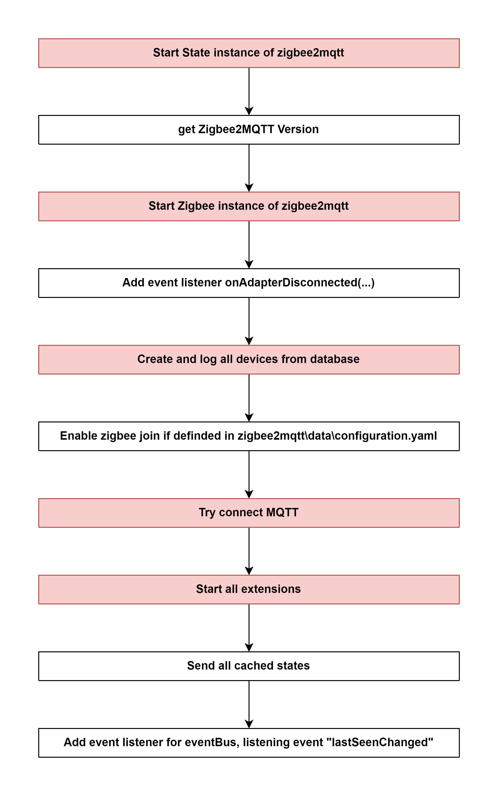

#  Start Controller of zigbee2mqtt

## External flow: [Zigbee Document - Step 5](../README.md#step-5-start-controller-of-zigbee2mqtt)

### Description
- This is the flow of `start()` method of Controller of `zigbee2mqtt`.
  
#### Class [Controller (zigbee2mqtt)](../objects/controller_zigbee2mqtt.md)

### Path
> zigbee2mqtt\lib\controller.ts

### Flow

### Step 1: [Start State instance of zigbee2mqtt](5_1_start_state_instance_of_zigbee2mqtt.md)

### Step 2: Get Zigbee2MQTT Version
- Run `utils.getZigbee2MQTTVersion()`.
- Get current version of zigbee2mqtt: `1.25.0`.

### Step 3: [Start Zigbee instance of zigbee2mqtt](5_3_start_zigbee_instance_of_zigbee2mqtt.md)

### Step 4: [Add event listener onAdapterDisconnected()](5_4_add_event_listener_onadapterdisconnected().md)

### Step 5: Create and log all devices from database

Class [Zigbee]()
Method [devices()]()

### Step 6: [Enable zigbee join if definded in zigbee2mqtt\data\configuration.yaml]
- if `permit_join` in `zigbee2mqtt\data\configuration.yaml` is set to `True` &rarr; Run [zigbee.permitJoin(True)]()

### Step 7: [Try connect MQTT](5_7_try_connect_mqtt.md)

### Step 8: Start all extensions

### Step 9: Send all cached states

### Step 10: Add event listener for eventBus, listening event "lastSeenChanged"

