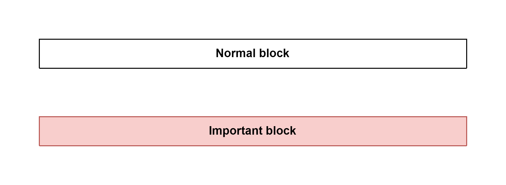
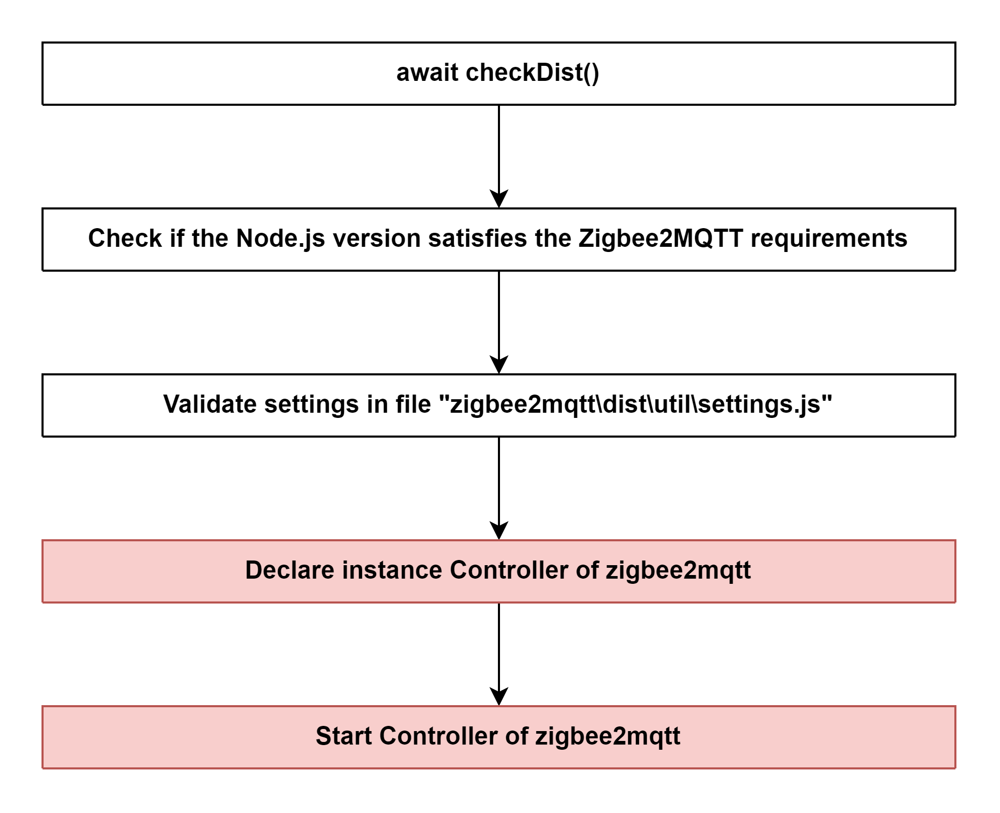

# Zigbee Document

#### Legend

## Initialization

### Path
> zigbee2mqtt\index.js

### Flow

### Step 1: [Declare instance Controller of zigbee2mqtt](sub_flow/1_declare_instance_controller_of_zigbee2mqtt.md)

[Controller (zigbee2mqtt)](objects/controller_zigbee2mqtt.md)

### Step 2: [Start Controller of zigbee2mqtt](sub_flow/2_start_controller_of_zigbee2mqtt.md)

## Event loop