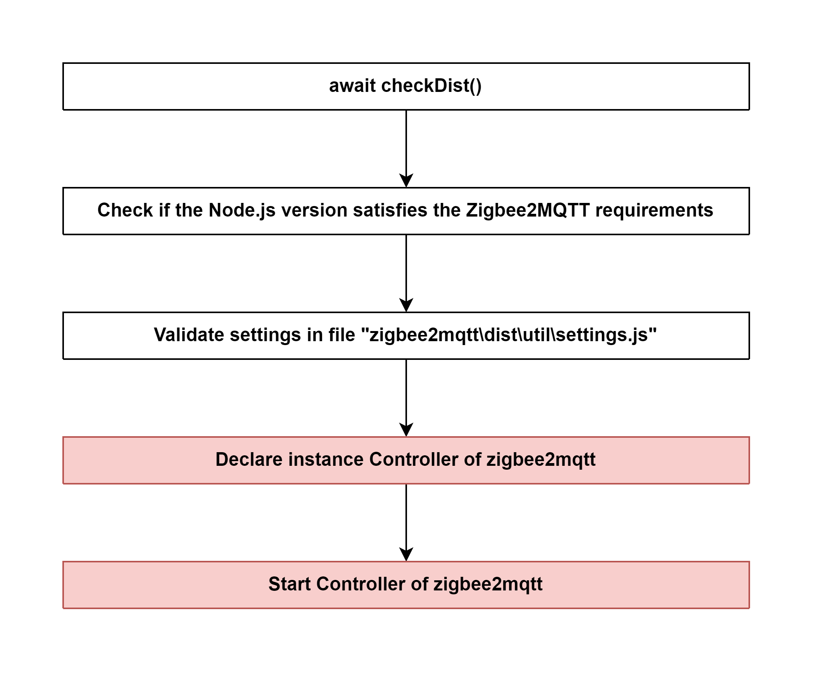

# Zigbee Document

#### Legend

## Initialization

### Path
> zigbee2mqtt\index.js

### Flow

### Step 1: await checkDist()
- Build zigbee2mqtt if it has not been built yet
- Build zigbee2mqtt if it has changes

### Step 2: Check if the Node.js version satisfies the Zigbee2MQTT requirements

### Step 3: Validate settings in file `zigbee2mqtt\dist\util\settings.js`

### Step 4: [Declare instance Controller of zigbee2mqtt](sub_flow/1_declare_instance_controller_of_zigbee2mqtt.md)

[Controller (zigbee2mqtt)](objects/controller_zigbee2mqtt.md)

### Step 5: [Start Controller of zigbee2mqtt](sub_flow/2_start_controller_of_zigbee2mqtt.md)

## Event loop